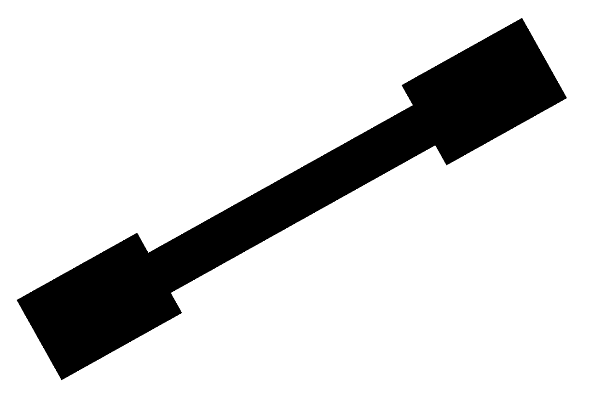
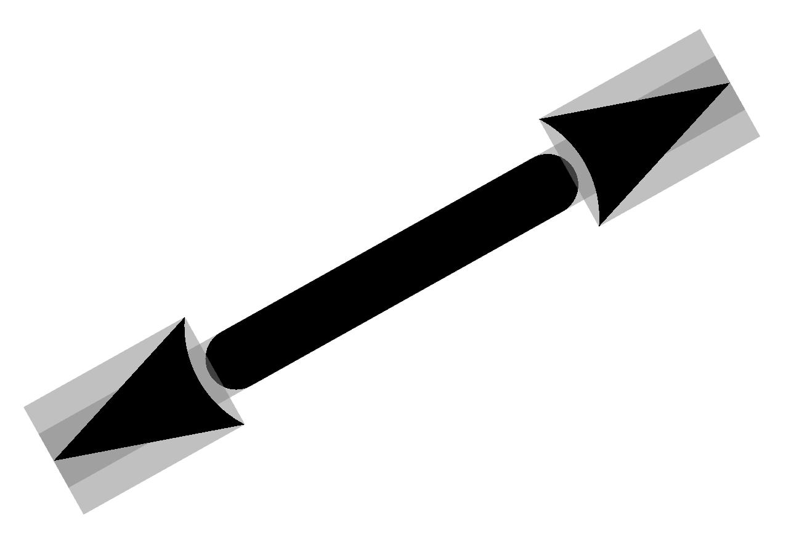

# threejs-dimensioning-arrow

[demo](https://roomle.github.io/threejs-dimensioning-arrow/dist/client/)

three.js - dimension arrow using [PlanGeometry](https://threejs.org/docs/#api/en/geometries/PlaneGeometry) objects, [ShaderMaterial](https://threejs.org/docs/#api/en/materials/ShaderMaterial)s for the dimensioning arrow and a [`CSS2DObject`](https://threejs.org/docs/#examples/en/renderers/CSS2DRenderer) object for the dimension text.

The geometry is composed of 4 [PlanGeometry](https://threejs.org/docs/#api/en/geometries/PlaneGeometry)  meshes, 2 for the shaft and 1 for each peak.

The actual shape of the dimension is created in the fragment shader of the [ShaderMaterial](https://threejs.org/docs/#api/en/materials/ShaderMaterial) through discarding fragments. In fact, the unwanted fragments are really discarded using the GLSL ([OpenGL Shading Language](https://www.khronos.org/opengl/wiki/OpenGL_Shading_Language)) [`discard`](https://www.khronos.org/opengl/wiki/Core_Language_(GLSL)#Control_flow) statement.

